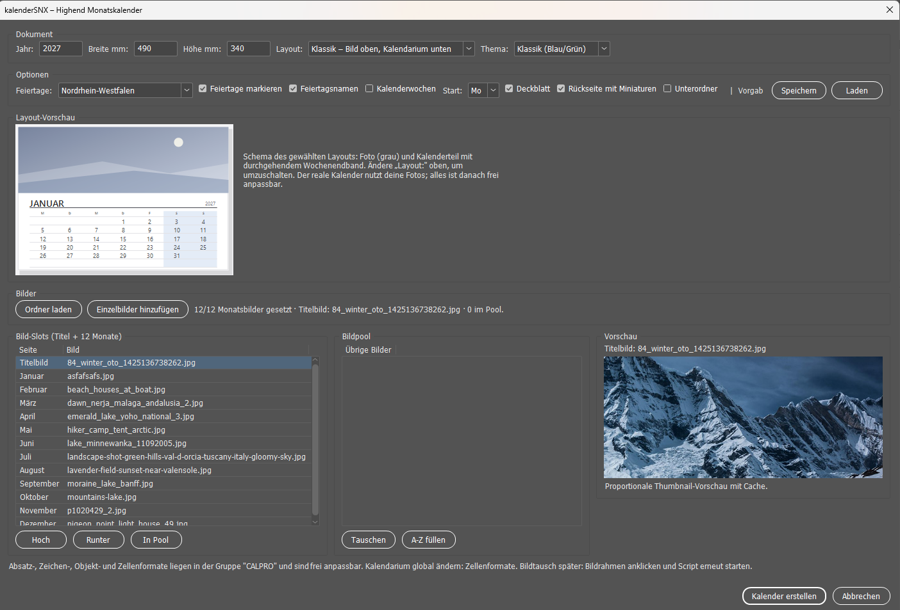
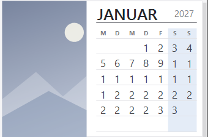
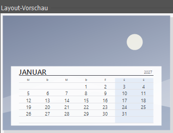

# KalenderSNX

`kalenderSNX.jsx` ist ein ExtendScript für Adobe InDesign. Das Skript erzeugt hochwertige Monatskalender mit eigenen Fotos, Layout-Vorlagen, Feiertagen, Kalenderwochen und wiederverwendbaren Presets.

Aktuelle Version: **10.1**

## Funktionen

- 12 Monatsseiten plus optionales Deckblatt und Rückseite mit Miniaturen
- 13 Bild-Slots: Titelbild und ein Bild pro Monat
- Layouts `Klassik`, `Split`, `Vollbild-Overlay` und `Galerie`
- sechs Farbthemen
- Feiertage für alle 16 deutschen Bundesländer
- Wochenstart Montag oder Sonntag
- optionale ISO-Kalenderwochen
- Bildauflösungsprüfung mit Warnung unter 200 ppi
- Bildpool und späterer Bildtausch über die Bildrahmen
- `.calpro`-Presets zum Speichern und Laden der Einstellungen
- zentrale CALPRO-Zellen-, Absatz-, Zeichen- und Objektformate, damit das fertige Dokument in InDesign weiter angepasst werden kann

## Installation

1. `kalenderSNX.jsx` herunterladen.
2. Die Datei in den InDesign-Ordner **Scripts Panel** kopieren.
3. In InDesign `Fenster > Hilfsprogramme > Skripten` öffnen.
4. `kalenderSNX.jsx` doppelt anklicken.
5. Jahr, Format, Layout, Thema und Bilder wählen und **Kalender erstellen** drücken.

Das Skript wurde mit Adobe InDesign Version 21.0 getestet. Es benötigt keine externen Pakete und stellt keine Netzwerkverbindungen her.

## Bilder

Für das vollständige Kalenderdokument können bis zu 13 Bilder geladen werden. Das Titelbild ist ein eigener Slot; wenn kein Titelbild ausgewählt wird, verwendet das Skript das Januarbild für das Deckblatt.

Die Screenshots zeigen den Dialog, die Layout-Vorschau, einzelne Monatsseiten und die Jahresübersicht:

## Versionsstand

- **10.1** — aktuelle Fassung aus dem InDesign-Skripte-Panel.
- **10.0** — historische Sicherung unter [`archive/kalenderSNX_v10.0_20260919-1248.jsx`](archive/kalenderSNX_v10.0_20260919-1248.jsx).

## Anpassung in InDesign

Nach dem Erstellen liegen die Formate in der Gruppe `CALPRO`. Absatz-, Zeichen-, Zellen- und Objektformate können dort angepasst werden; die Änderungen bleiben im Dokument editierbar.

## Lizenz

Für dieses Repository ist derzeit keine separate Open-Source-Lizenz angegeben. Die Veröffentlichung dient zunächst der Dokumentation und Versionsverwaltung.
